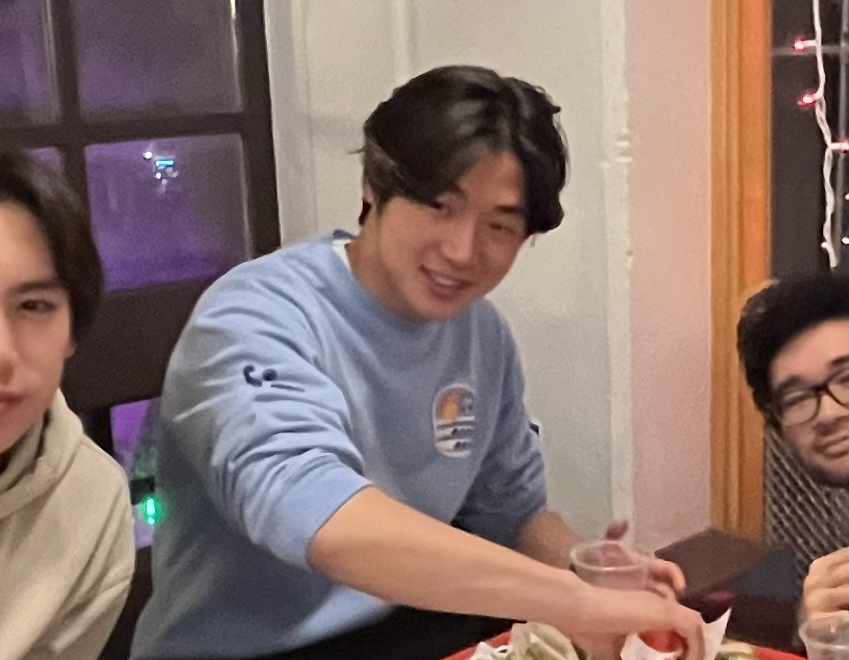

# David Wang
The following is an attempt to use all the core markdown constructs. I hope you enjoy the read.


Quote of the year:
> "HO HO HO" - Jay Paek

## About Me:
(If you don't care, skip to the next [section](#coding))
- Second year computer engineering student at the insanely prestigious, beautiful, handsome, wonderful, smart, selective, incredible, unique, irreplaceable, ancient, modern University of California, San Diego (**UCSD**)

- <sub> small </sub> ego
- Interests in signal processing and neural engineering
- Currently taking CSE 110, which is the reason behind this sites very existence and the contents that wil soon follow

## Coding

Here are my current favorite things about programming (in order):


1. Environment issues
2. Bugs
3. Assembly

On the topic of coding, here's a snippet of the most advanced piece of code I have written. Do not feel ashamed if you are unable to comprehend its higher purpose:
```python
def swap(a, b):
    a, b = b, a
    return a, b

a, b = swap(a, b)
```
Just kidding. That was a joke, if you couldn't tell. Here's an actual linked project [sample](https://www.youtube.com/watch?v=uHgt8giw1LY).


## Hobbies
Feel free to learn more about my experiences.
- [Surfing](surfing.md)
- [Lifting](lifting.md)

### Conclusion
Thank you for reading. Allow me to leave you off with some of my goals this quarter.

- [x] Attend at least two CSE 110 lectures
- [ ] Learn how to be a software engineer
- [ ] Become a LeetCode master
- [ ] \(Optional\) Be happy

